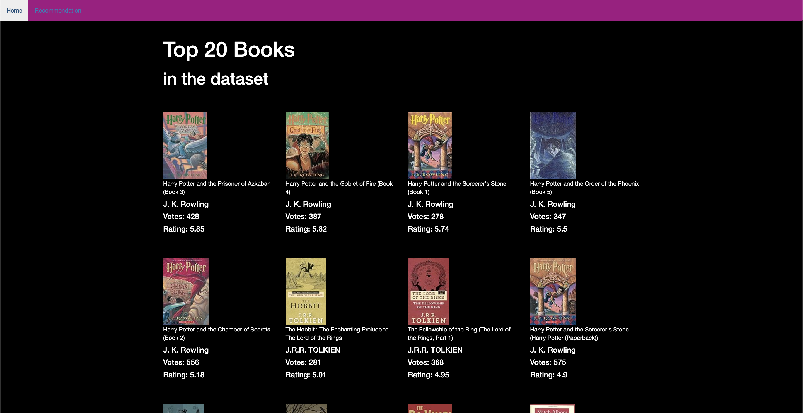
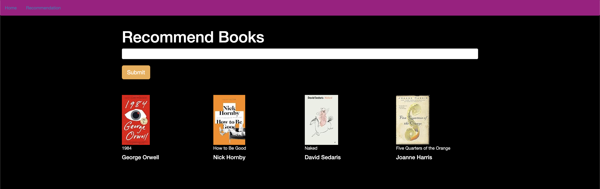

<div align="center">
    <h1>Book recommendation system</h1>
</div>

## A Machine Learning model deployed with a user interface to predict the price of laptops

### Introduction
A variety of laptop datasets that have eleven features; from company name to operating system. The aim is to predict the price in euro `target`.


### Repository Structure
* **README.md**: The top-level README for reviewers of this project
* **requirements.txt**: requirements file; including the needed tools
* **notebooks**: `01.data_exploration.ipynb` is for exploring the dataset. `02.recommendation_system.ipynb` is for building our recommendation program.
* **pkl_file**: pkl files from `02.recommendation_system.ipynb`
* **static**: 
    - **data folder**: has the datasets.
    - **img folder**: has the images used in README.md.
* **templates folder**: This folder for html files.
* **app.py**: Flask application to give the recommendations
* **Procfile**: .

### Libraries
* pandas
* NumPy
* flask


### Algorithm
Collaborative Filtering Based Recommender System

## Getting the app running localy
1. Colone this repo
```
git clone https://github.com/khalidsbn/Laptop-Price-Predictor.git
```
2. Create and activate a virtual environment
```
python3 -m venv .venv
source .venv/bin/activate
```
3. Install the required dependencies (pandas, Numpy, etc)
```
pip install -r requirements.txt
```
4. Change into the `app` directory
```
cd app
```
5. Run app.py


Running the above command should result in you seeing the following:



This page has the most 20 popular books.

6. Try to enter the name of a book


7. Click show to get the recommendations



### Known issues
Still updating ...
